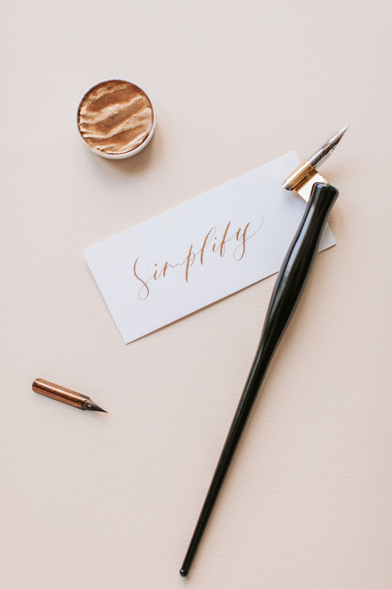

+++
title = "About Calligraphy"
layout = "page"
+++

**Cal·lig·ra·phy** *(kəˈliɡrəfē)* n.  
decorative handwriting or handwritten lettering
{.text-align-right}

Calligraphy is a theme by [Patrick A Collins](https://pacollins.com/) for [Hugo](https://gohugo.io/) static site generator. Inspired by its namesake, the theme aims to
provide a simple canvas that is elegant and ensures high readability for all
visitors.

